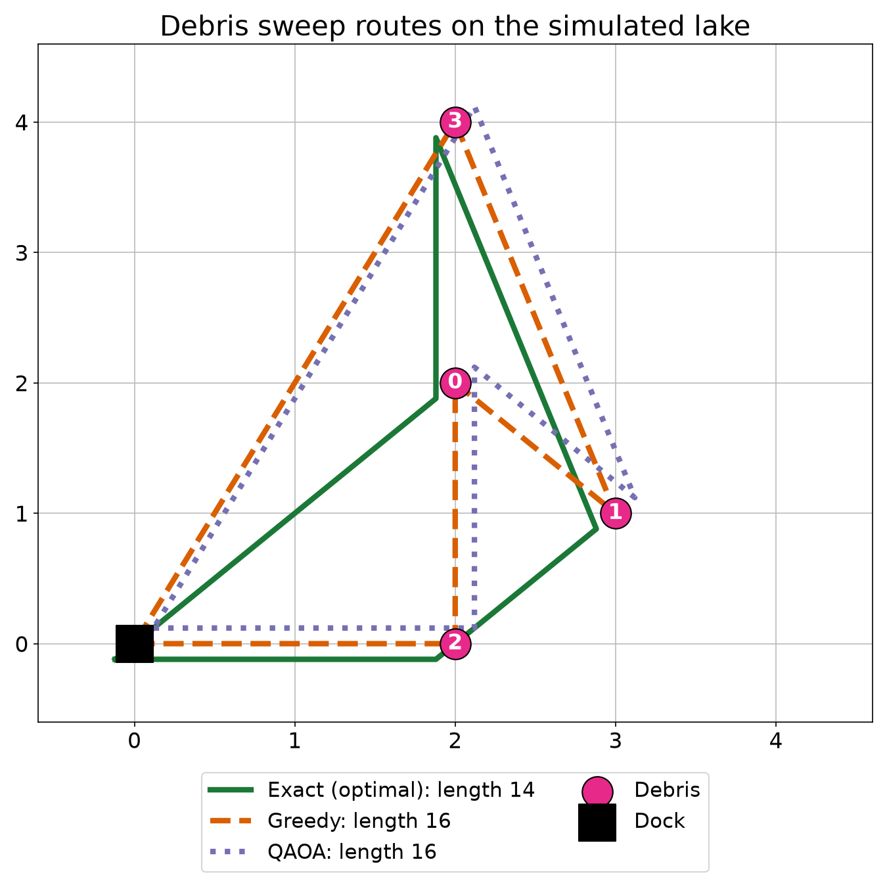
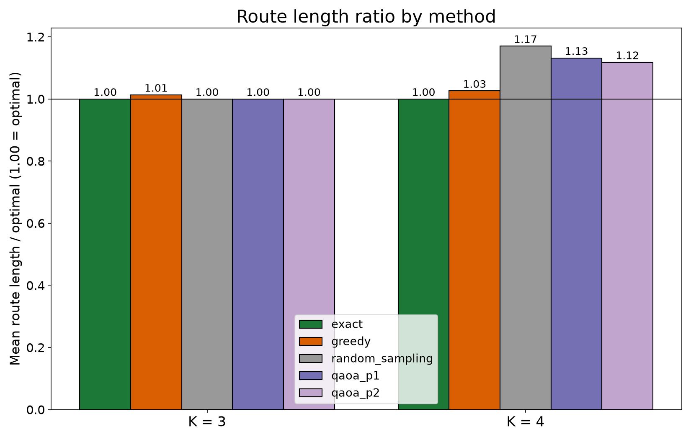

# Quantum debris-sweep planner for Water Rover

This is a working simulation of a quantum route planner for a debris-collecting rover. A quantum algorithm (QAOA, run on a simulator) decides the order in which the rover visits floating debris on a lake, and I compare it with classical planners on 20 random lakes. It is a first step: the pipeline works end to end, and it gives us a clear list of what to improve next.

## Where it came from

This grows out of our first hackathon project, [Water_Rover](https://github.com/Bhavana-Chandra/Water_Rover). It is a rover built around a NodeMCU and a motor controller, driven from the Blynk IoT app. It collects floating debris with an escalator mechanism and a net, and a Raspberry Pi Zero 2W streams live video from it. I set up the Raspberry Pi and the live stream on that project.

The rover works, but a person steers it with the controller, so every decision about where to go next is a manual one. That is fine for one piece of debris. For a lake with debris scattered around, the order of visits decides how much battery and time the rover burns, and a human is not a good route optimiser. That gap is what this project starts from: replace "the operator decides" with "the planner computes the route", and since this hackathon is about quantum software, try a quantum optimisation algorithm for the planner.

**The rover is not part of this prototype.** I do not have it with me for this hackathon. Everything here is a simulation on a laptop. No hardware, Blynk, Pi or camera code is involved.

[FILL: one or two sentences in my own words about why I care about water pollution or why I picked this.]

## The problem and the question

Given a dock and several debris spots, find the shortest route that visits every spot and returns to the dock. This is the Travelling Salesman Problem (TSP). It is NP-hard, so the work grows quickly as spots are added, which is why researchers are looking at quantum optimisation such as QAOA for problems of this shape.

My question: on a tiny simulated lake, can a QAOA planner find good sweep routes, and how does it compare with simple classical planners? I am not claiming a speedup. I wanted a working, measured baseline that we can build on.

## What I built

- **The lake** (`src/lake.py`): a 5x5 grid, the dock at a corner, and K random debris spots, reproducible by seed. Distance is Manhattan distance because the rover moves along grid lines.
- **Classical planners** (`src/classical.py`): greedy nearest-neighbour, and brute force over every ordering (the true optimum at this size, used as the reference).
- **The quantum planner** (`src/qaoa_tsp.py`): described below.
- **Benchmark** (`src/benchmark.py`, `run_benchmark.py`): all methods on 20 random lakes at K=3 and K=4, written to `results/`.
- **Demo** (`demo.py`): one command, one fixed lake, step-by-step terminal output and a route figure.
- **Tests** (`tests/`): distances, greedy and brute-force correctness, QUBO against brute force, and the QAOA operator against the QUBO.

## How the quantum part works

**1. Turn the route into bits.** For K spots I use K x K binary variables, where `x[i][t] = 1` means "spot i is visited at step t". The dock is always the start and end, so it needs no variables. With K=4 that is 16 variables, so 16 qubits.

**2. Write the route cost as a QUBO.** The cost is the total distance: dock to the first spot, between consecutive spots, and last spot back to the dock. Each leg becomes a term that only counts when two spots sit at neighbouring steps. I build this as a matrix directly in `build_qubo`, so every term is visible.

**3. Add penalties for invalid routes.** Most bitstrings are not real routes (a spot visited twice, or a step with no spot). Two penalty groups raise the cost when that happens. The weight matters: too small and the lowest-energy bitstring is an invalid route that cheats, too large and the distance term is drowned out. I checked it by brute force. For all 2^16 bitstrings on 15 lakes I looked at whether the lowest-energy one was the optimal route. Weights of 1 and 2 never gave it, 4 gave it on 6 of 15 lakes, and 6 or more gave it on all 15. I use 2x the longest distance between any two points, which is above that threshold.

**4. Convert to a quantum problem and run QAOA.** The QUBO is converted to an Ising operator (substituting x = (1 - Z)/2). I added a test that its diagonal matches the QUBO energies, to catch bit-order mistakes. QAOA runs through `qiskit-algorithms` on the Aer simulator with COBYLA as the classical optimiser, at depth p=1 and p=2. A K=4 solve takes about 3 to 8 seconds on my laptop.

**5. Read the answer.** QAOA returns a distribution over bitstrings, not one answer. I decode every sampled bitstring, drop the invalid ones, and keep the shortest valid route. I also record how many shots were valid routes and how much probability sat on the optimal route.

**A control.** With 4096 samples, random guessing can find a good route on a tiny problem. So the benchmark includes "random sampling": the same number of random bitstrings, decoded the same way. QAOA has to beat that to show the circuit is doing something.

## Results

20 random lakes per size, from `results/benchmark.csv` and `results/summary.txt`. Ratio is route length divided by the optimal length (1.00 = optimal), averaged over lakes where the method found a valid route.

**K=4 (16 qubits)**

| Method | Mean ratio | Found the optimum | Found any valid route |
|---|---|---|---|
| Exact (brute force) | 1.00 | 100% | 100% |
| Greedy | 1.03 | 80% | 100% |
| Random sampling | 1.17 | 25% | 65% |
| QAOA p=1 | 1.13 | 45% | 75% |
| QAOA p=2 | 1.12 | 60% | 95% |

**K=3 (9 qubits)**: greedy 1.01 (optimal on 90% of lakes). Exact, random sampling, QAOA p=1 and QAOA p=2 all reached 1.00 on every lake.




**What this shows**

- The full pipeline works and is checked at each step: the QUBO's best answer matches brute force, the quantum operator matches the QUBO, and QAOA produces valid routes on the simulator.
- At 16 qubits, QAOA does better than the random-sampling control: it finds the optimum more often (45% at p=1, 60% at p=2 against 25%) and finds a valid route more often. Going from p=1 to p=2 helps. So the circuit is learning something about the problem.
- Greedy is currently the stronger planner, at 1.03 of optimal against about 1.12 for QAOA, and it costs almost nothing to run. I expected that at this size, and it is the number QAOA has to beat.
- The main weakness is where the probability goes. Only about 0.3% of QAOA's shots at K=4 are valid routes, and at p=1 it found no valid route on 5 of the 20 lakes. That is the clearest thing to fix, and the plan below targets it.
- K=3 is too easy to separate QAOA from luck, because random sampling also gets every lake. K=4 is where the comparison starts to mean something.
- The demo lake (seed 16) was picked because the exact route is visibly shorter than the others, so it is not a typical lake. On it, QAOA found the same route as greedy (length 16, optimal is 14).

## Where this can go in the next few weeks

Everything below is a plan, not something already done.

1. **Raise the valid-route rate.** Right now QAOA wastes almost all its shots on invalid bitstrings. Two things to try: more optimiser restarts and better starting angles, and a QAOA mixer designed to keep the state inside valid routes, so invalid ones are not sampled in the first place. I do not know yet how much either will help, and that is what the next runs would measure.
2. **Noise.** Real quantum devices make errors, and this prototype ran on a noise-free simulator, so the numbers here are a best case. The next step is to add Qiskit Aer noise models, measure how the valid-route rate drops as error grows, keep the circuits shallow, and try error mitigation. This tells us how far the approach can go before real hardware.
3. **Real hardware.** Run the same circuits on an IBM device through Qiskit and compare with the noisy simulation.
4. **Bigger lakes.** A flat QUBO needs K x K qubits, which grows fast. For larger lakes the likely route is hybrid: split the debris into small clusters, solve each cluster with the quantum planner, and join the results.
5. **A more realistic lake.** Add currents, obstacles and a battery limit to the model.
6. **Back to the rover.** Send the planned waypoints to the real rover, so the operator approves a route instead of choosing every move by hand.

## What I learned

- A weak penalty weight gives invalid routes. The brute-force scan showed it directly, and I would not have trusted a weight chosen by feel.
- Aer cannot run the high-level QAOA circuit directly. The first call failed with "unknown instruction: QAOA", and the circuit has to be transpiled into basic gates first.
- On Python 3.14, Windows Application Control blocked a DLL inside scipy, which `qiskit-algorithms` needs. I moved to a Python 3.11 virtualenv instead of working around the policy.
- A control matters. Random bitstrings are valid routes about 1.2% of the time at K=3 and 0.04% at K=4, so a tiny problem can look solved by luck. That is why the benchmark has a random-sampling baseline.
- My first charts were misleading. I drew diagonal lines though the rover moves on grid lines, and my bar chart started at zero and hid the differences. I redrew both.
- Penalty weight did not clearly help QAOA when I compared 6, 8 and the default on a few lakes. The results were too noisy to choose, so I kept the default.

## Limitations

- Simulator only, no noise model and no real quantum hardware.
- A 5x5 grid with 3 to 4 debris spots.
- One QAOA run per lake and a limited number of optimiser steps, so QAOA's numbers can likely improve with more tuning.
- No quantum speedup or advantage is claimed.

## Run it

Tested with Python 3.11.

```
python -m venv .venv
.venv\Scripts\activate          (Windows)   or   source .venv/bin/activate
pip install -r requirements.txt
python demo.py                   (live, about 10 seconds)
python demo.py --cached          (reuses the saved QAOA result, labelled as cached)
python run_benchmark.py          (20 lakes at K=3 and K=4, a few minutes)
python run_benchmark.py --replot (redraw the chart from the saved CSV)
python -m pytest                 (tests)
```

## Run it in Google Colab (no install)

If you do not want to set up Python locally, there is a notebook that runs the same demo in the browser.

1. Open https://colab.research.google.com/github/Bhavana-Chandra/rover-router/blob/main/demo_colab.ipynb
2. Sign in with a Google account if Colab asks.
3. Choose Runtime, then Run all.
4. Wait about a minute. The notebook clones this repo, installs Qiskit, runs `demo.py`, and shows the route figure and the saved benchmark chart.
5. If Colab asks you to restart the runtime after the install step, restart it and choose Run all again.

It runs the same simulation as the local demo. The last cell optionally re-runs a small benchmark, but three lakes is too few to compare methods, so the 20-lake table above is the one to read. I have tested the notebook's commands in a clean local environment, but not inside Colab itself, so tell me if a cell fails there.

## How this was built

I used Claude Code for coding assistance while building this. [FILL: anything the hackathon's AI-tools policy requires. I will check the Devfolio page.]

## References

- Qiskit Optimization: https://qiskit-community.github.io/qiskit-optimization/
- Qiskit Algorithms: https://qiskit-community.github.io/qiskit-algorithms/
- Qiskit documentation: https://docs.quantum.ibm.com/
- Related reading, which I have not reproduced or extended:
  - https://arxiv.org/abs/2407.08767 (multi-robot coverage path planning with quantum computing)
  - https://arxiv.org/abs/2510.07413 (grid path planning with parallel QAOA circuits)
  - https://arxiv.org/abs/2304.09629 (quantum-assisted solution paths for the capacitated vehicle routing problem)

## Team

[FILL: team members, college, roles]
